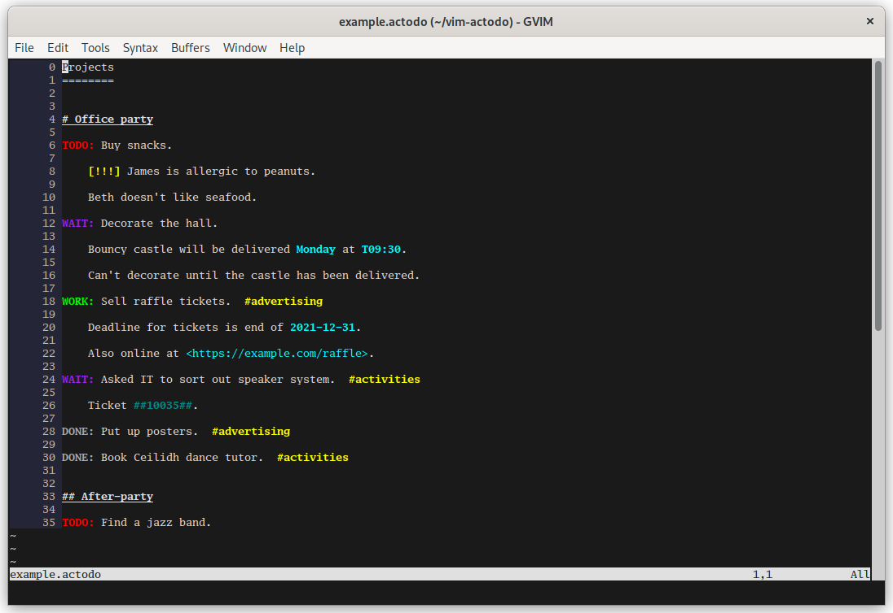

# vim-actodo

This is a very basic TODO list syntax plugin.
There are no fancy keybindings, and nothing automatic.
It simply formats a TODO list to make it easier to track what you are working on.

## Supported keywords

Lines beginning with `#` will be shown in bold and should be used as headers.
You can use multiple hash characters for different levels but they will all be formatted the same.
Leading whitespace is ignored.

Lines beginning with `TODO:`, `WORK:` (for work-in-progress), `WAIT:` (for jobs waiting on someone else), or `DONE:` are your tasks, with the associated status.

URLs enclosed with angled brackets will be shown in blue, as will dates in a subset of the ISO 8601 format (`YYYY-mm-dd`, `YYYY-mm-ddTHH:MM`, and `THH:MM`, with or without a trailing `Z`).

Tags begin with a # and a letter, and must be two or more letters long.

Any other lines will be shown in plain text, and are designed for notes or comments on the tasks.

## Example

An example list can be found in the file [example.actodo](example.actodo) in this repository.
Files should have the extension `.actodo`.

